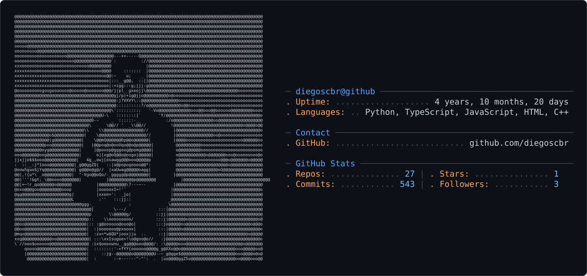

<picture>
  <source media="(prefers-color-scheme: dark)" srcset="dark_mode.svg" />
  <source media="(prefers-color-scheme: light)" srcset="light_mode.svg" />
  
</picture>

# 💫 About Me:
Hey! Welcome to my corner of the internet! I'm a junior SWE currently working in MarTech.  When I'm not building marketing intelligence systems,  you will usually find me on the water, sailing, or building projects around the marine and performance sailing industry.  Although salt and hardware generally do not mix, I hope to one  day be able to blend my love for the sea with my interest in  computers. 

## 🌐 Socials:
   

# 💻 Tech Stack:
          
# 📊 GitHub Stats:
 
 

## 🏆 GitHub Trophies

### ✍️ Random Dev Quote

### 🔝 Top Contributed Repo

---

<!-- Proudly created with GPRM ( https://gprm.itsvg.in ) -->

